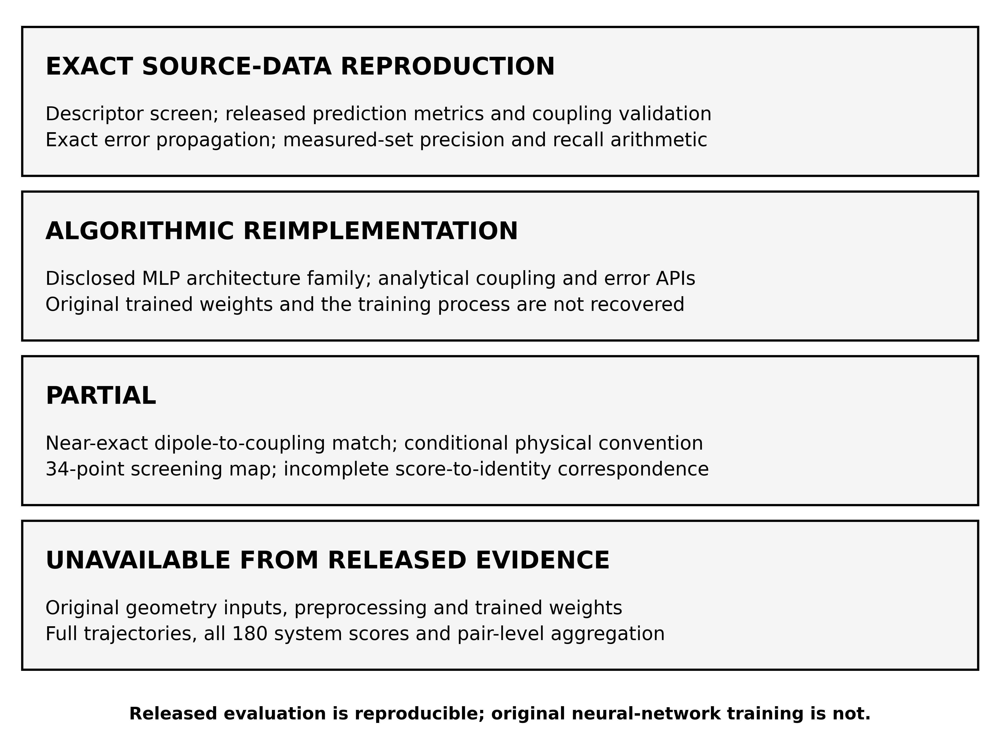
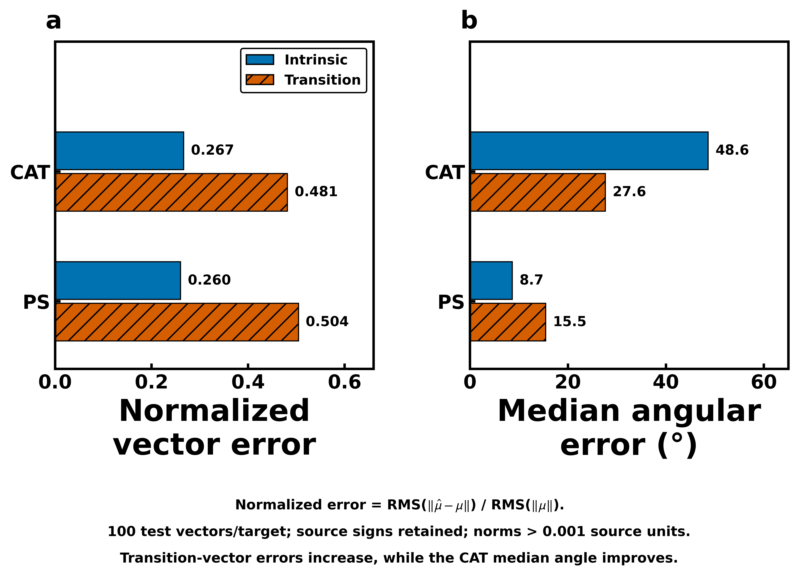
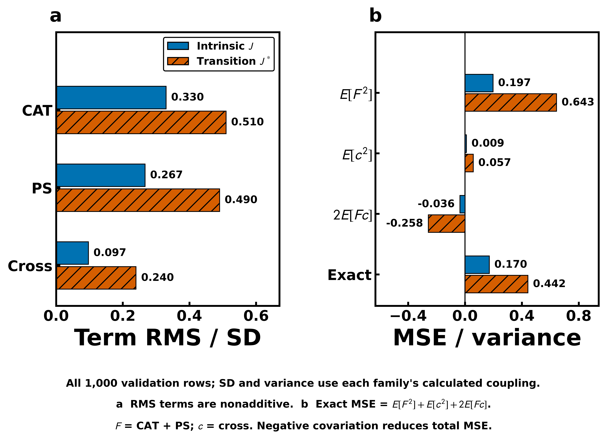
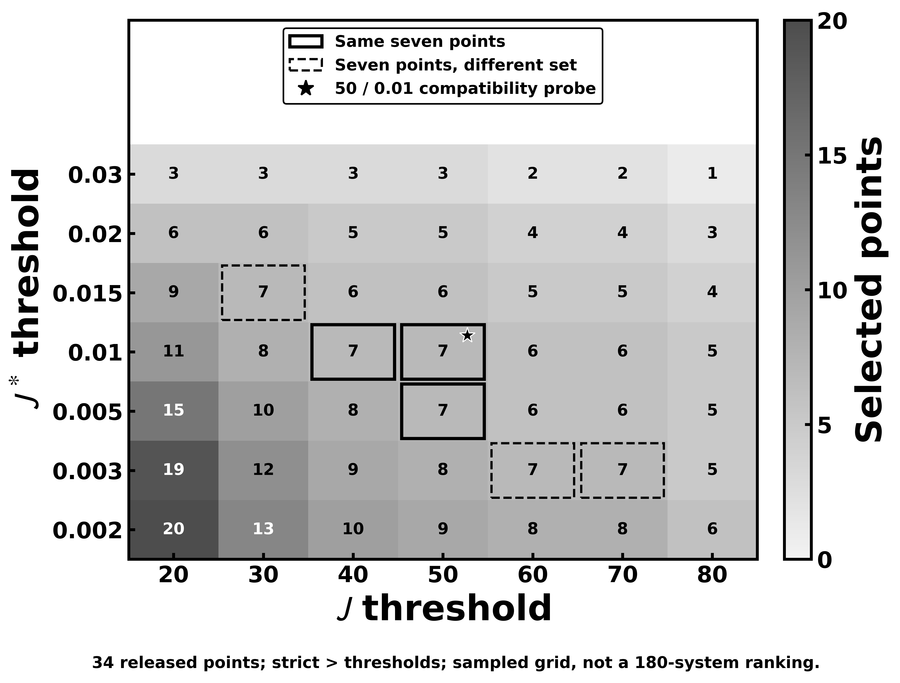

# Reproducing the released machine-learning evaluation of molecular photocatalysis

Technical note on Hu et al., “Identifying a highly efficient molecular photocatalytic
CO₂ reduction system via descriptor-based high-throughput screening”,
*Nature Catalysis* **8**, 126–136 (2025),
[doi:10.1038/s41929-025-01291-z](https://doi.org/10.1038/s41929-025-01291-z).

The released prediction tables support an independent evaluation of the paper's
machine-learning results and a numerical reconstruction of its dipole-coupling
workflow. They also expose distinctions between component accuracy, vector fidelity
and screening performance. This note reports that source-data reproduction without
new molecular dynamics, quantum chemistry or model training. The quantitative basis
is the [ML evaluation report](../forensics/reports/PHASE2_ZERO_COMPUTE_ML_REPRODUCTION.md)
and its linked analytical summaries.

## 1. What the original paper did

Hu et al. organized the search around combinations of a molecular catalyst (CAT)
and a photosensitizer (PS). Their chemical universe comprised 84 catalysts and 41
photosensitizers, giving 3,444 combinations. A descriptor screen retained catalysts
with CO₂ adsorption energy below −0.20 eV and photosensitizers with lifetime above
90 ns. Applying these strict inequalities to the released descriptors gives 18 CAT
and 10 PS identities, or 180 retained combinations.

The paper then describes molecular dynamics (MD), sampling of molecular conformations,
first-principles dipole calculations and neural-network prediction. Its MD protocol
specifies 1,000 sampled conformations per retained combination, giving 180,000
conformations. The detailed Methods describes selecting 1,000 CAT conformations and
1,000 PS conformations separately for labelling. The quantum-chemical disclosures
include Gaussian 16, ωB97XD, LANL2DZ for transition metals, 6-31G(d) for other atoms
and a polarizable continuum solvent treatment. The PS dipoles refer to the reduced
photosensitizer. These are published method statements, not calculations repeated
in this reproduction. [Article Methods, PDF pp. 7–8; source anchors in the
methods audit](../forensics/reports/PAPER_METHODS_AUDIT.md).

Machine learning supplies intrinsic and transition dipole vectors from molecular
coordinate features. A dipole-dipole expression converts the vectors into intrinsic
coupling, J, and transition coupling, J*. Statistical averaging and coupling-based
screening then identify systems for experiment. Thus the neural networks accelerate
dipole acquisition within the proposed workflow; they do not directly predict CO₂
turnover number or photocatalytic activity. The experimental selection depends on
the intervening coupling and screening operations.

The disclosed network family is modest: two hidden ReLU layers, candidate widths
256, 512 or 1,024, L1 regularization, three Cartesian outputs and Adam with learning
rate 10⁻⁴. The repository represents these constraints without constructing or
training a network. How the published vector predictions propagate through the
subsequent algebra can therefore be studied independently of rebuilding the original
geometry-to-dipole model.

## 2. What source data are actually released

The release supports several different levels of reproduction. All 84 catalyst
adsorption descriptors and all 41 PS lifetimes are available. Their identities
are corroborated by indexed supplementary tables, permitting reconstruction of
the first screen without recalculating any descriptor.

Supplementary Figs. 5–8 provide four prediction families: CAT intrinsic, PS intrinsic,
CAT transition and PS transition dipoles. Each contains calculated and predicted
x, y and z values in separate 900-row training and 100-row test blocks. These are
vector records, not 2,700 independent training conformations obtained by pooling
three components. Supplementary Fig. 9 supplies 1,000 calculated/predicted J pairs
and 1,000 calculated/predicted J* pairs. Its rows have no explicit split labels;
their numerical correspondence to the dipole blocks is established algebraically.
[Workbook layouts and semantic axis interpretation](../forensics/reports/WORKBOOK_ML_AUDIT.md).

Downstream coverage is narrower. The Fig. 1d workbook contains only 34 positive
J/J* points, largely without system identities. Fig. 1e provides measurements for
43 systems; Supplementary Table 3 additionally lists an unmeasured selected system.
The coordinate release contains initial and final MD endpoints for all 3,444
combinations, amounting to 6,888 endpoint files. Endpoints do not recover intervening
trajectories or identify which geometries generated the dipole labels.

The missing items include the original feature matrix X, authenticated
geometry-to-label joins, trained weights and full trajectories. A saved prediction
can be evaluated without knowing how its model was fitted, but that evaluation
cannot regenerate the predictor. This distinction defines the scope throughout
the note. Publisher PDFs, workbooks, coordinates and full numerical extracts remain
local-only; the repository distributes code, aggregate statistics and derived
analysis under its [source policy](SOURCE_POLICY.md).

**Figure A. Reproducibility depends on the object being assessed.** Exact evaluation
of released values, implementation of disclosed algorithms, partial screening recovery
and unavailable original computations are distinct outcomes. Coupling-table
reconstruction retains the precision and physical-convention limits described below.

## 3. What can be reproduced exactly

All 32 per-component and pooled train/test scalar metric records are independently
reproduced from the dipole tables. The maximum numerical difference from the earlier
independent calculation is below 4.45 × 10⁻¹⁶. The calculations report Pearson
correlation, predictive R², mean absolute error, root-mean-square error (RMSE) and
signed bias. Predictive R² is defined as 1 − SSE/SST, rather than the square of
Pearson correlation. [Complete scalar results](../data/derived/ml_scalar_metrics.csv).

For the 100 test vectors in each family, the pooled Cartesian results are:

| Dipole target | Pearson r | Predictive R² | RMSE |
|---|---:|---:|---:|
| CAT intrinsic | 0.964168 | 0.928739 | 2.171721 |
| PS intrinsic | 0.965538 | 0.931915 | 1.515579 |
| CAT transition | 0.879775 | 0.768187 | 0.046658 |
| PS transition | 0.864336 | 0.745103 | 0.278501 |

These raw RMSEs retain their respective source numerical units. Their different
scales prevent direct comparison of intrinsic and transition difficulty by absolute
error alone. Three families have lower pooled test RMSE than training RMSE; PS
transition is the exception. Such gaps describe the supplied blocks and do not
identify leakage, chemical transfer or a statistically significant performance change.

The coupling-validation calculations also reproduce the paper's rounded
correlations, approximately 0.913 for J and 0.748 for J*:

| Metric over 1,000 validation rows | J | J* |
|---|---:|---:|
| Pearson r | 0.912925953 | 0.747549173 |
| Predictive R² | 0.829605104 | 0.558007372 |
| RMSE, source numerical units | 224.144248 | 0.494507892 |
| Sign agreement | 747/1,000 (74.7%) | 743/1,000 (74.3%) |
| Signed Spearman ρ | 0.777783 | 0.692213 |
| Signed Kendall τ-b | 0.612444 | 0.529767 |
| Signed top-100 overlap | 80/100 | 65/100 |

These are rankings of **1,000 validation rows, not 180 photocatalytic systems**.
Spearman correlation uses average ranks for ties; Kendall τ-b accounts for ties.
Top-k selects exactly k rows, resolving exact ties by original row order. Both
source coupling channels contain positive and negative values, with no exact zeros.

Magnitude ranking provides a useful qualification. Spearman correlation of |J|
is 0.664335, whereas that of |J*| is slightly higher at 0.673865. Nevertheless,
absolute top-100 overlap is lower for J*, 53/100 versus 78/100. Global rank
correlation and agreement at the extreme tail answer different questions. The
[rank summaries](../data/derived/coupling_rank_metrics.csv) retain both, including
bounded top-k and bottom-k comparisons.

## 4. Reverse-engineering the dipole-coupling transformation

Concatenating each dipole sheet's 900 training rows followed by its 100 test rows
reveals a common transformation. With C and P denoting CAT and PS vectors in the
released component frame,

$$
J=s(-2C_xP_x+C_yP_y+C_zP_z),\qquad
s=5.034063649307054.
$$

The same expression applies to J* using transition dipoles. The scalar was estimated
only from the first 900 calculated intrinsic-coupling rows. It was then held fixed
for the remaining 100 rows and all predicted intrinsic and transition channels.
No neural network or arbitrary tensor matrix was fitted.

The final-100 calculated-J reconstruction has RMSE 0.000303257. Across all 1,000
rows, calculated-J R² is 0.9999999999996017. Alternative fixed-separation tensors
along y and z, each given its own scalar fitted on the same 900 rows, have
final-100 RMSEs of 316.699574 and 440.821399. Their best unconstrained prefactors
are negative. Thus x is overwhelmingly favored under the released component labels.
This does not identify an absolute laboratory direction: reversing the separation,
jointly rotating the transverse axes or consistently relabelling coordinates leaves
equivalent tensor descriptions. [Axis and sign/permutation tests](../forensics/reports/PHASE1_COUPLING_RECONSTRUCTION.md#4-axis-uniqueness-tests).

The tensor is physically compatible with the published dipole approximation,

$$
J=\frac{1}{4\pi\epsilon_0 r^3}
\left[\mathbf C\cdot\mathbf P-
3(\mathbf C\cdot\hat{\mathbf r})(\mathbf P\cdot\hat{\mathbf r})\right].
$$

Using independently evaluated physical constants, Debye dipoles and Å distances
give a coefficient of 5034.116566872031 cm⁻¹ per D² Å⁻³, including the Coulomb
prefactor. Under vacuum screening, the observed scalar therefore implies
`r_eff = (5034.116566872031/s)^(1/3) = 10.00003503953813 Å`.
Debye-like dipoles, a cm⁻¹-like coupling convention and a fixed x-aligned
near-10 Å representation form a strong, conditional forensic inference. They
are not explicitly documented author settings.
[Constants and unit conversions](../forensics/reports/PHASE1_COUPLING_RECONSTRUCTION.md#5-physical-constantunit-reconstruction).

Two limits matter. First, units and distance are not separately identifiable:
Debye dipoles with meV coupling instead imply a plausible 4.98644 Å separation.
Second, exactly 10 Å with modern constants gives scalar 5.034116566872031,
outside the conditional five-decimal rounding interval
[5.034062503876238, 5.034066337226311] from the calculated intrinsic fit rows.
The near-10 Å inference is strong; exact recovery of the authors' prefactor is not.

All calculated-J residuals fit deterministic five-decimal nearest-rounding bounds.
The larger residuals in other channels are compatible with heterogeneous
five-decimal/three-significant-digit export precision. Compatibility neither proves
the original rounding procedure nor identifies its precise cause. A fixed effective
tensor could result from standardized centres, an aligned pair frame with normalized
distance, or another equivalent convention. The released arrays do not determine
which operation connected the authors' MD geometries to their coupling values.

## 5. Why J* prediction is worse

The degradation becomes clearer when vector errors are measured relative to vector
signal. Define normalized error as
`RMS(||mu_hat−mu||)/RMS(||mu||)`. This ratio compares the error and signal on the
same scale and avoids averaging unstable relative errors for individual weak vectors.
For the **100 test vectors per family**, the principal contrasts are:

| Diagnostic | Intrinsic | Transition |
|---|---:|---:|
| CAT normalized vector error | 0.267 | 0.481 |
| PS normalized vector error | 0.260 | 0.504 |
| CAT median angular error | 48.6° | 27.6° |
| PS median angular error | 8.7° | 15.5° |
| PS magnitude Pearson r | 0.861 | 0.591 |

**Figure B. Vector accuracy has both scale and direction components.** Comparisons
use the 100 released test vectors per target. Transition normalized errors increase
for both species, whereas median angular error improves for CAT and worsens for PS.
Angles preserve vector signs and require both norms above 0.001 in source units.

Both transition families have substantially larger signal-relative vector errors.
PS transition magnitude prediction is particularly weak: its predictive magnitude
R² is −0.189, meaning its squared error exceeds that of a constant calculated-mean
benchmark on these rows. Its mean norm bias is −0.18635 in source units, consistent
with underestimating magnitude. Yet angular behavior differs between species:
CAT transition improves in median angle, while PS transition worsens. A blanket
claim that transition vectors have poorer directions would be incorrect.

Angles preserve the released signs and require both norms above 10⁻³ in source
dipole units. All rows meet that default. A bounded threshold check at 10⁻⁴ and
10⁻² changes the CAT transition test median from 27.63° to 26.19° at the higher
cutoff, which excludes eight rows. Other test groups are unchanged except for one
excluded PS transition row. The poorer PS transition direction summary therefore
persists after this weak-vector check. Undocumented electronic-state phase choices
remain a limit on physical interpretation.

Magnitude and direction also receive unequal weight in the coupling. A large
vector and its partner can contribute strongly to J even when many weaker vectors
have poor directions. For example, CAT intrinsic test median angle is 69.13° in
the lowest calculated-norm quartile and 5.04° in the highest. Across both couplings,
the exact algebra below identifies larger magnitude and direction error channels
relative to the transition-coupling signal.

Sign-flip frequency alone provides little explanation for the correlation loss:
it changes from 253/1,000 for J to 257/1,000 for J*. Second-order error is relatively
larger for J*, but its negative covariation reduces total squared error in both
families. The supported interpretation is poorer signal-relative vector fidelity
propagated through a bilinear coupling with partner-vector and covariance effects.
It is an algebraic account of these released predictions, not a causal explanation
of why the original networks produced their errors. [Vector and residual summaries](../forensics/outputs/phase2_ml_vectors.json).

## 6. Exact error decomposition

The recovered tensor makes propagation of prediction errors analytically tractable.
Let `T = diag(−2,1,1)`, `J = s CᵀTP`, and write predicted vectors as
`C_hat=C+dC` and `P_hat=P+dP`. Expanding gives

$$
\Delta J=s\left[
\underbrace{d\mathbf C^{\mathsf T}T\mathbf P}_{\text{CAT error}}
+\underbrace{\mathbf C^{\mathsf T}T d\mathbf P}_{\text{PS error}}
+\underbrace{d\mathbf C^{\mathsf T}T d\mathbf P}_{\text{cross error}}
\right].
$$

The first two terms contain one vector error and one calculated partner. The third
contains both errors and is the exact second-order contribution. Resolving each
term into x, y and z products gives its Cartesian attribution without fitting
additional parameters. Summation agrees with independently evaluated
`J_predicted−J_calculated` to maximum absolute discrepancies below 1.03 × 10⁻¹²
for J and 1.34 × 10⁻¹⁵ for J* over all 1,000 aligned rows. These are floating-point
closure checks on couplings reconstructed from dipoles. They are distinct from the
small rounding-compatible residuals against the separately released Fig. 9 values.

Normalizing term RMS by the population standard deviation of calculated coupling
permits a common comparison across the **1,000-row validation blocks**:

| Error contribution | J: RMS/calculated SD | J*: RMS/calculated SD |
|---|---:|---:|
| CAT | 0.329870 | 0.509887 |
| PS | 0.266702 | 0.490267 |
| Cross | 0.096791 | 0.239574 |
| Total | 0.412790 | 0.664871 |

**Figure C. Error terms reinforce and cancel.** Summaries use all 1,000 validation
rows per coupling. Normalized term RMS values are nonadditive. The signed
second-moment correction shows that adding the cross term reduces total MSE,
despite its positive individual second moment. Panel a divides RMS by each family's
calculated-coupling SD; panel b divides second moments by its calculated-coupling
variance, with F denoting the first-order sum and c the cross term.

These are not additive error fractions. For contributions a, b and c,
`E[(a+b+c)²]` includes the three second moments and the signed terms
`2E[ab]+2E[ac]+2E[bc]`. The analysis retains those cross moments and their
covariance/bias decomposition.

For J, the first-order approximation has R² 0.944939 relative to the exact coupling
error; the omitted cross term has RMS 52.557410, or 23.45% of total-error RMS.
Nevertheless, including it reduces MSE from 58,096.9388 to 50,240.8420. For J*,
first-order R² is 0.870161 and cross RMS is 0.178188, or 36.03% of total-error RMS;
including the cross term reduces MSE from 0.355662 to 0.244541. Negative cross
moments outweigh the positive cross-term second moment in both cases. Relatively
larger second order therefore does not imply a larger net error penalty.

A symmetric magnitude/direction allocation further separates vector-norm changes
from direction changes while sharing the CAT–PS cross term equally. It closes
exactly and retains covariance. Magnitude-channel RMS/calculated SD rises from
0.250897 for J to 0.433583 for J*; the direction channel rises from 0.323898 to
0.486381. Both contribute to the signal-relative degradation. The x coefficient
doubles each x contribution compared with a signed −1 arithmetic control, but
total MSE also depends on cross-axis covariation. None of these allocations provides
unique causal shares. [Exact definitions and computed decompositions](../forensics/outputs/phase2_error_propagation.json).

## 7. Screening reproduction

The released screening map permits a partial reconstruction. Fig. 1d contains
34 positive points, not the full 180-system score table. The strict probe
`J>50 AND J*>0.01` selects seven released points. This matches the reported count
but does not uniquely identify the authors' thresholds or authenticate all point
identities.

A fixed 7 × 7 grid around that region produces six cells selecting seven points.
Only three preserve the same seven-member point set as the 50/0.01 probe.
The other seven-count cells have different membership. These comparisons use
coupling scores alone; thresholds were not optimized against experimental outcomes.
[Threshold-count and membership sensitivity](../data/derived/screening_sensitivity.csv).

**Figure D. Seven selected points do not uniquely identify a threshold or membership.**
The 49 cells summarize selection among 34 released points. Six cells select seven
points; three retain the reference probe's same seven members. The plot shows
derived counts and membership comparisons, rather than the source score coordinates.
Solid boxes indicate the same set; dashed boxes indicate different seven-point sets;
the star marks 50/0.01. The grid samples thresholds, rather than identifying
continuous selection regions.

The same-set intervals are also nonunique. Holding the J* cutoff at 0.01 allows
a J cutoff anywhere in [32.06871, 50.81013). Holding the J cutoff at 50 allows
a J* cutoff in [0.00342, 0.0137). These are one-axis conditional intervals,
not a jointly valid rectangle of threshold pairs. A count or membership match
therefore cannot identify a unique screening classifier.

Supplementary Table 3 establishes the selected chemical identity set:
CAT1/PS1, CAT37/PS41, CAT49/PS1, CAT61/PS4, CAT49/PS18, CAT49/PS33 and CAT50/PS41.
The star's numerical point can be associated with CAT1/PS1 through the published
figure/text anchor, a high-confidence inference. The other six selected
coordinate-to-identity assignments remain unresolved. No missing 146 scores are
imputed, and validation-row rank fidelity cannot supply the absent system-level
ranking. The further mapping from conformation-level coupling to pair score is
also missing: “statistical average” does not identify signed mean, mean absolute
value, absolute signed mean or root-mean-square aggregation.

## 8. Experimental validation

The measured validation evidence consists of six filtered systems and 37 ruled-out
systems. All 43 measured identities and their turnover/selectivity values agree
between the released Fig. 1e table and Supplementary Table 3. The latter additionally
lists CAT50/PS41, which was selected but not experimentally measured because CAT50
was not synthesized. CAT61/PS33 is the exceptional ruled-out success under the
reported classification.

The declared arithmetic is recoverable: measured-set precision is
`6/6 = 100%`, and measured-set recall is `6/(6+1) = 85.714%`. The unmeasured
selected system does not belong in measured precision's denominator because no
observed outcome identifies it as a true or false positive. Treating it as a
failure would add an outcome absent from the release; dividing by all seven
initial predictions would answer a different question.

A joint probe requiring CO turnover number above 1,370 and CO selectivity above
72% reproduces the reported labels, with true-positive/false-positive/false-negative/
true-negative counts of 6/0/1/36. It remains a compatible numerical rule, not a
uniquely disclosed experimental-good classifier. Nearby conditional thresholds
preserve those labels. Consequently, the recovered precision and recall apply
to the tested subset and reported outcome classes. They do not measure recall
across all 180 retained systems or all 3,444 initial combinations.
[Experimental correspondence and arithmetic](../forensics/reports/PHASE2_ZERO_COMPUTE_ML_REPRODUCTION.md#13-experimental-validation-reproduction).

## 9. What cannot be reproduced

The original training pipeline cannot be reconstructed from prediction tables.
The missing or unresolved items fall into three linked groups:

- **Inputs and provenance:** exact original X; labelled geometry-to-row mapping;
  atom-selection schema and ordering; coordinate preprocessing; charge, state,
  dipole-origin and transition-phase conventions.
- **Model and training:** full model count/grouping; selected hidden widths;
  L1 strength and scope; loss; batch size; epochs; early stopping; seed;
  complete optimizer settings; output activation; and trained weights.
- **Physical sampling and screening:** full trajectories; authenticated labelled
  conformations; complete 180 pair scores; pair-level aggregation rule; and
  exact unit, distance and frame processing before coupling evaluation.

The dependency-light architecture specification encodes only the disclosed family.
Configurable unknowns remain distinct from explicit choices for an independent
implementation. Representing two hidden ReLU layers and three outputs does not
establish the authors' fitted architecture or reproduce their predictions from X.
Likewise, complete endpoint coverage does not authenticate the missing MD time series.

Several published inconsistencies also remain open. The printed adsorption-energy
expression contains a catalyst-energy plus sign; schematic accounting of paired
conformations differs from the separate CAT/PS sampling described in Methods.
Evaluating released descriptors and dipoles does not require silently resolving
either issue. The article's qualification of model transfer to similar geometries
cannot be independently tested without geometry identities and weights. Nor can
wall-clock acceleration be quantified without the original executable model and
a matching computational baseline. These are specific evidence gaps, rather than
deficiencies that repeated statistical analysis can remove.
[Claim-by-claim boundaries](../forensics/reports/ML_CLAIM_SCORECARD.md).

## 10. Bottom line

New MD, density-functional theory or time-dependent density-functional theory is
**not scientifically necessary for this bounded source-data ML reproduction**.
The released arrays determine the evaluated scalar and vector errors, coupling
validation, algebraic error propagation, validation-row ranking and measured-set
arithmetic. New trajectories or quantum labels would not change what those tables
say, and no model training is required to evaluate their supplied predictions.

The resulting artifact therefore supports a precise claim: the released ML
evaluation is reproducible, the dipole-to-coupling transformation is nearly exactly
reconstructed within stated evidence limits, and the weaker J* result is quantitatively
accounted for by signal-relative vector errors and their bilinear propagation.
Screening recovery remains partial, and original-network reproduction remains
unavailable.

Independent quantum-label validation, chemical-transfer testing or regeneration of
the complete computational campaign would be distinct studies. They require missing
author artifacts and/or a separately specified new dataset and computational protocol.
The repository preserves an optional full-computation plan for that purpose without
making it a prerequisite for understanding the published evaluation. The practical
reuse path is to obtain the publisher files independently, run the deterministic
analysis and synthetic checks, and interpret each result at its documented evidence
level. The [scope definition](ZERO_COMPUTE_ML_REPRODUCTION.md) and
[reproducibility matrix](../forensics/reports/REPRODUCIBILITY_MATRIX.md) distinguish
exact source-data arithmetic, algorithmic implementation, partial recovery and
unavailable evidence.
